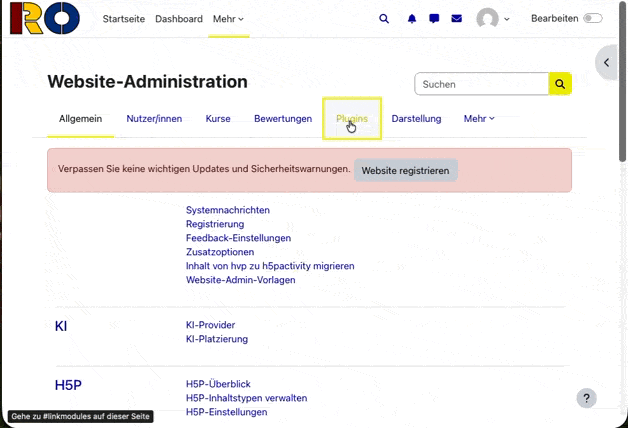
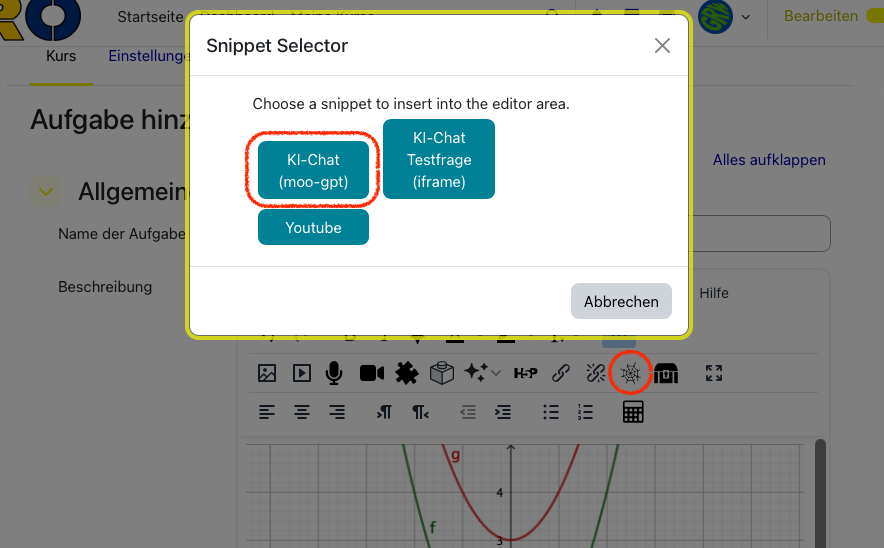

# Installation & Konfiguration

> **Getestet auf:** Debian 12 LXC-Container auf Proxmox. Für andere Umgebungen (andere Linux-Distributionen, VMs, native Server) sind die Schritte weitgehend identisch – Paketnamen und Pfade können abweichen. Eine KI-Assistenz (z. B. Claude Code) kann notwendige Anpassungen auf Nachfrage zuverlässig vornehmen.

## Voraussetzungen

- Linux-Server, VM oder LXC-Container (Debian/Ubuntu empfohlen)
- Node.js 22
- OpenAI-API-Key (platform.openai.com)

## Installation

`better-sqlite3` ist ein natives Addon und benötigt Build-Tools:

```bash
apt-get install -y build-essential
npm install
```

## Umgebungsvariablen

Alle Konfiguration erfolgt über Umgebungsvariablen. Empfohlen: `/etc/moo-gpt.env`

| Variable | Pflicht | Beschreibung |
|---|---|---|
| `APIKEY` | ✅ | OpenAI API Key |
| `MODEL_NAME` | ✅ | Fallback-Modell, z. B. `gpt-5`. Wird beim ersten Start in die DB migriert – danach im Dashboard änderbar. Hinweis: wird in einer späteren Version mit `AVAILABLE_MODELS` zusammengeführt. |
| `ADMIN_USER_IDS` | empfohlen | Kommagetrennte Moodle-User-IDs der initialen Admins, z. B. `12345,67890`. Ohne diesen Eintrag ist das Dashboard nur per direktem SQL-Zugriff einrichtbar. Danach im Dashboard verwaltbar. |
| `AVAILABLE_MODELS` | – | Kommagetrennte Liste der im Dashboard angebotenen Modelle, z. B. `gpt-5,gpt-4o,gpt-4.1-mini`. Alle Modelle müssen Vision unterstützen. Standard: nur `MODEL_NAME`. |
| `TEACHER_USER_IDS` | – | Kommagetrennte Moodle-User-IDs, die serverseitig als Lehrkraft eingestuft werden – unabhängig vom Client-Flag. Nützlich als Fallback bei abweichenden Themes. Wird in einer späteren Version im Dashboard verwaltbar sein. |
| `ALLOWED_ORIGIN` | – | Kommagetrennte Liste erlaubter Origins, z. B. `https://moodle.beispiel.de`. Ohne diese Variable ist jede Origin erlaubt. |
| `MAX_REQUESTS` | – | Max. Anfragen pro IP und Tag, z. B. `4`. |
| `DB_PATH` | – | Pfad zur SQLite-Datenbankdatei. Standard: `./chats.db` |

### Beispiel `/etc/moo-gpt.env`

```env
APIKEY=sk-proj-...
MODEL_NAME=gpt-5
ADMIN_USER_IDS=12345,67890
AVAILABLE_MODELS=gpt-5,gpt-4o,gpt-4.1-mini
ALLOWED_ORIGIN=https://moodle.beispiel.de
DB_PATH=/opt/moo-gpt/chats.db
```

## Server starten

```bash
npm start
```

## Als Systemdienst einrichten (empfohlen)

Beispiel-Unit `/etc/systemd/system/moo-gpt.service`:

```ini
[Unit]
Description=moo-gpt
After=network.target

[Service]
Type=simple
WorkingDirectory=/opt/moo-gpt
EnvironmentFile=/etc/moo-gpt.env
ExecStart=/usr/bin/node server.js
Restart=on-failure

[Install]
WantedBy=multi-user.target
```

```bash
systemctl enable moo-gpt
systemctl start moo-gpt
journalctl -u moo-gpt -f   # Logs verfolgen
```

## Docker

Kein fertiges Image vorhanden – Image selbst bauen:

```bash
docker build -t moo-gpt .
docker run -d -p 3000:3000 \
  --env-file /etc/moo-gpt.env \
  -v /opt/moo-gpt/chats.db:/usr/src/app/chats.db \
  -v /opt/moo-gpt/public/storage:/usr/src/app/public/storage \
  moo-gpt
```

## Reverse Proxy / HTTPS

moo-gpt erwartet HTTPS und WebSocket-Upgrade. Der Server lauscht auf Port `3000`, WebSocket-Pfad `/api/chat`.

Gängige Optionen: Nginx, Caddy als Reverse Proxy oder ein Cloudflare Tunnel. Letzteres ist die einfachste Variante ohne eigene TLS-Zertifikate:

```bash
# Cloudflare Tunnel (einmalige Einrichtung über das Cloudflare-Dashboard)
cloudflared service install
# Tunnel leitet moo-gpt.beispiel.de → localhost:3000 weiter
```

## Zeitzone

Für korrekte Log-Zeitstempel:

```bash
timedatectl set-timezone Europe/Berlin
```

Die Zeitstempel im Chat-Fenster werden unabhängig davon korrekt dargestellt (clientseitig aus UTC umgerechnet).

---

## Einbindung in Moodle (Admin)

Dieser Abschnitt richtet sich an Moodle-Administratoren. Die Einbindung des Chat-Widgets erfordert Admin-Rechte in Moodle.

### Voraussetzung: Snippet-Plugin installieren

moo-gpt wird über das TinyMCE-Plugin **Snippet für TinyMCE** (`tiny_snippet`) in Moodle eingebunden. Das Plugin muss einmalig von einem Moodle-Administrator installiert werden.


### Snippet importieren

Im Verzeichnis `snippets/` liegt die fertige Snippet-Datei `moo-gpt.txt`.

Import per Drag & Drop: Die Datei direkt in das Snippet-Plugin ziehen. Vor dem Import `gpt.gruenwald.fun` durch die URL der eigenen moo-gpt-Instanz ersetzen (zwei Stellen in der Datei).

Das Snippet hat den Namen **„KI-Chat (moo-gpt)"** und den Key **`moogpt`**. Im TinyMCE-Editor `moogpt` eingeben und **Tab** drücken (nicht Enter) – der Dialog öffnet sich.



### Snippet in einer Aufgabe verwenden

Nach dem Import kann das Snippet in jeder Moodle-Aufgabe über den TinyMCE-Editor eingefügt werden.


