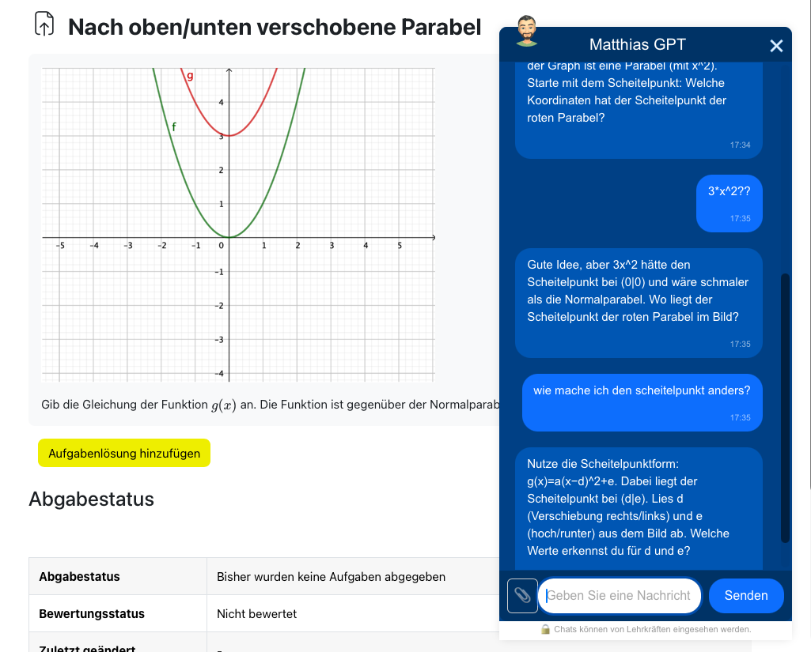
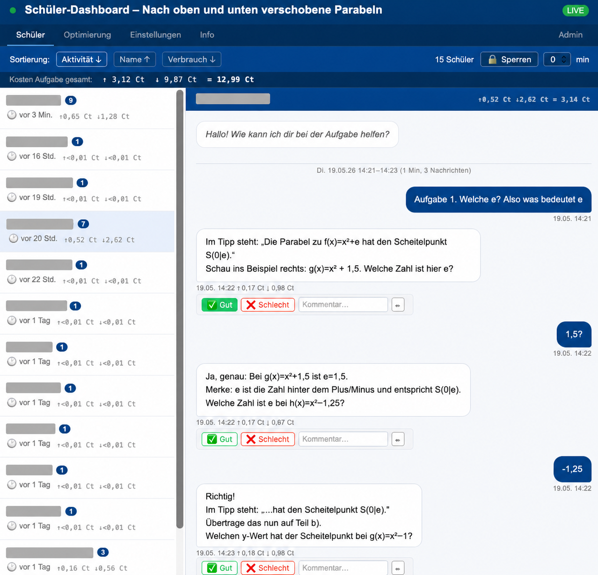

# moo-gpt

KI-Chatbot-Widget für Moodle. Lehrkräfte betten einen KI-Assistenten direkt in Aufgaben ein – ohne separaten Login für Schülerinnen und Schüler.

Das Lehrer-Dashboard zeigt alle Schülerchats in Echtzeit und bietet Steuerungsfunktionen direkt aus dem Unterricht.

---

## Was ist moo-gpt?

- **Floating Chat-Widget** direkt in Moodle-Aufgaben eingebettet (TinyMCE-Snippet, kein Plugin)
- **Lehrer-Dashboard** mit Schülerchats, Token-Kosten und Live-Updates
- **Selbst gehostet** – Schülernamen und IDs bleiben auf dem eigenen Server
- **OpenAI-Modelle** (GPT-5 und weitere) als KI-Backend

## Schnellantworten

| Frage | Antwort |
|---|---|
| Was kostet es? | Server selbst betreiben + OpenAI-API-Kosten – kein Abo, kein SaaS |
| Wo landen Schülerdaten? | Lokal auf dem eigenen Server (SQLite) – Namen und IDs verlassen den Server nicht |
| Was geht zu OpenAI? | Der Inhalt der Chatnachrichten und alle Bilder (Aufgabe + Schüler-Uploads) |
| Was brauche ich? | Linux-Server, Node.js 22, Moodle mit TinyMCE, OpenAI-API-Key |
| Welches Moodle-Theme? | Boost (Standard) – andere Themes prüfen |

## Features

### Chat-Widget

- Chat-Widget direkt in Aufgaben einbettbar
- Aufgabentext und Bilder werden automatisch an die KI übergeben
- Thread-Persistenz: Schüler setzen den Chat nach Seitenreload nahtlos fort
- Audio-Eingabe: Spracheingabe per Mikrofon mit automatischer Transkription (OpenAI Whisper)
- TTS-Ausgabe: KI-Antworten vorlesen lassen (OpenAI TTS, Stimme konfigurierbar); optional mit Auto-Play
- Widget-Position umschaltbar (links/rechts), gespeichert für die aktuelle Browsersitzung

### Dashboard & Unterrichtssteuerung

- Lehrer-Dashboard mit Chatverlauf, Live-Updates und Token-Kosten
- Live-Unterrichts-Überblick: thematische Zusammenfassung aller Chats auf Knopfdruck, gruppierte Übersicht aktiver und nicht aktiver Schüler
- KI-Antworten im Dashboard inline bearbeitbar (versioniert); Schüler sehen die aktive Version
- Plenumsmodus: Chat für alle Schüler einer Aufgabe sperren – direkt aus dem Widget oder dem Dashboard, manuell oder mit Timer
- Schüler-Memory: Schüler können ihr Memory im Chat einsehen und bearbeiten; Lehrkräfte verwalten die Schüler-Memories im Dashboard
- Schülerantworten im Dashboard bewertbar; Bewertungen fließen in KI-gestützte Prompt-Verbesserungsvorschläge ein *(wird voraussichtlich nicht weiterentwickelt – Prompt-Assistent und Prompt-Check decken diesen Bedarf effektiver ab)*

### Prompt & Modell

- Modellwahl pro Aktivität (OpenAI-Modelle konfigurierbar)
- Prompt-Assistent: Erfahrungsprompt per KI-Dialog erstellen (mit Rückfragen) oder direkt generieren
- Prompt-Check: Prompt auf Schwachstellen analysieren und verbesserten Vorschlag übernehmen
- Prompt-Optimierung per Simulation: vollautomatisch mit einem Klick oder manuell – auch ohne echte Schüler-Chats *(wird voraussichtlich nicht weiterentwickelt – Prompt-Assistent und Prompt-Check decken diesen Bedarf effektiver ab)*

## Dokumentation

| Zielgruppe | Dokument |
|---|---|
| Admins / IT | [INSTALL.md](INSTALL.md) – Installation, Konfiguration, Docker, Systemd |
| Lehrkräfte | [docs/moodle.md](docs/moodle.md) – Moodle-Einbindung, Snippets, Dashboard |
| Entwickler | [CONTRIBUTING.md](CONTRIBUTING.md) – Architektur, Datenbankschema, Roadmap |

---

## Datenschutz & rechtliche Hinweise

### Was wird wo gespeichert?

| Daten | Speicherort |
|---|---|
| Schülername, Moodle-User-ID | Lokal in SQLite auf dem Server des Betreibers |
| Chatverlauf (Nachrichten) | Lokal in SQLite **und** zur Verarbeitung an OpenAI übertragen |
| Bilder (Aufgabe + Schüler-Uploads) | Alle Bilder werden an OpenAI übertragen. Unter 2 MB: zusätzlich lokal in SQLite gespeichert. Über 2 MB: nur bei OpenAI (wird nach begrenztem Zeitraum automatisch gelöscht, lokal nur Referenz-ID) |

**Schülernamen und Moodle-IDs verlassen den Server nicht.** Die Inhalte der Chatnachrichten und alle Bilder werden zur Verarbeitung an die OpenAI-API gesendet.

### EU-konformer Betrieb und DSGVO-Hinweise

KI-Chatbots werden an deutschen Schulen bereits breit eingesetzt – z. B. [AIS.chat](https://ais-chat.schule) (ehemals telli, seit Februar 2026 landesweit in Niedersachsen über die Niedersächsische Bildungscloud freigegeben). AIS.chat nutzt ebenfalls OpenAI-Modelle, jedoch über Azure mit EU-Inferenz und hat eine behördliche Freigabe. moo-gpt bietet eine selbst gehostete Alternative mit voller Kontrolle über die eigene Instanz.

Für vollständig EU-seitige Verarbeitung stehen zwei Wege bereit:

- **OpenAI Enterprise mit EU-Inferenz-Residency** (seit Januar 2026) – kein Code-Umbau nötig
- **Azure OpenAI mit EU-Region** – erfordert eine kleine Konfigurationsänderung (→ [Issue #32](https://github.com/matthiasgruenwald/moo-gpt/issues/32))

#### Wenn du direkt mit der Standard-OpenAI-API arbeitest

Bei Nutzung der Standard-OpenAI-API werden Chatnachrichten und Bilder auf Servern außerhalb der EU verarbeitet. In diesem Fall ist der Betreiber (Schule oder Schulbehörde) **datenschutzrechtlich Verantwortlicher** im Sinne von Art. 4 Nr. 7 DSGVO – nicht der Entwickler dieses Projekts. Vor dem Betrieb sind dann folgende Schritte erforderlich:

1. **Auftragsverarbeitungsvertrag (AVV)** mit OpenAI abschließen (Art. 28 DSGVO) – verfügbar unter platform.openai.com
2. **Schulkonferenz oder Schulbehörde** über den KI-Einsatz informieren (je nach Bundesland unterschiedlich)
3. **Datenschutzerklärung** der Schule um die KI-Nutzung ergänzen (Art. 13 DSGVO)
4. **Schüler und Eltern** darüber informieren, dass Chatnachrichten zur Verarbeitung an OpenAI übertragen werden
5. **Keine personenbezogenen Daten** in Chatnachrichten eingeben (technisch nicht erzwungen)

### Haftungsausschluss

Dieses Projekt wird **ohne jegliche Gewährleistung** bereitgestellt. Der Entwickler übernimmt keine Haftung für:

- Datenverlust oder Datenschutzverletzungen beim Betreiber
- Schäden durch unbefugten Zugriff auf den Server
- Schäden durch fehlerhafte oder unangemessene KI-Antworten
- Kosten durch OpenAI-API-Nutzung

Die Nutzung erfolgt auf eigene Verantwortung des Betreibers. Siehe auch [LICENSE](LICENSE) (AGPL-3.0, Abschnitt 15–17).

---

## Herkunft & Entwicklungsstand

moo-gpt ist eine Weiterentwicklung von [mmbbs-gpt](https://service.joerg-tuttas.de:82/root/mmbbs_gpt) von Jörg Tuttas.

Dieses Projekt wird von einer Lehrkraft ohne formale Informatikausbildung entwickelt, überwiegend mit Unterstützung von KI-Werkzeugen. Der Code entspricht möglicherweise nicht in allen Teilen professionellen Softwarestandards. Es wird aktiv daran gearbeitet, eine solide Struktur für die Weiterentwicklung durch andere zu etablieren.

Das Projekt befindet sich in aktiver Weiterentwicklung. Breaking Changes zwischen Versionen sind möglich – **keine Stabilitätsgarantie**.

## Feedback, Fehler & Wünsche

Fehler oder Verbesserungsvorschläge können als Issue gemeldet werden – das gilt ausdrücklich auch für Lehrkräfte und Administratoren, nicht nur für Entwickler:

→ [Neues Issue anlegen](https://github.com/matthiasgruenwald/moo-gpt/issues/new)

---

## Lizenz

[AGPL-3.0-or-later](LICENSE) – Nutzung und Weiterentwicklung frei, Änderungen müssen unter gleicher Lizenz veröffentlicht werden, auch bei Netzwerkbetrieb (SaaS).
