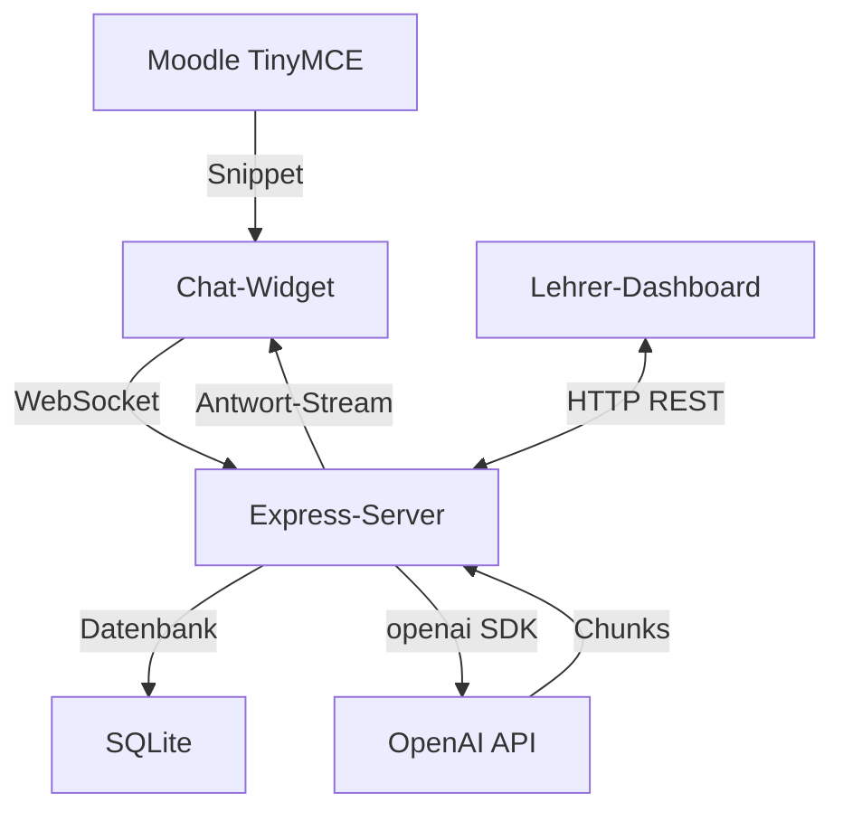
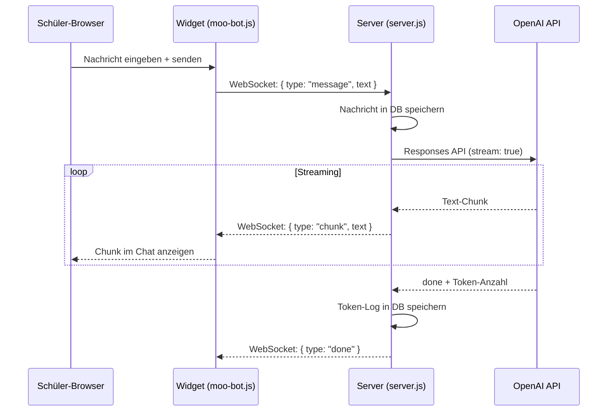

# moo-gpt — Architektur

## Systemkomponenten

```mermaid
flowchart TD
    Moodle["Moodle TinyMCE"]
    Widget["Chat-Widget"]
    Dashboard["Lehrer-Dashboard"]
    Server["Express-Server"]
    DB["SQLite"]
    OpenAI["OpenAI API"]

    Moodle -->|Snippet| Widget
    Widget -->|WebSocket| Server
    Server -->|Antwort-Stream| Widget
    Dashboard <-->|HTTP REST| Server
    Server -->|Datenbank| DB
    Server -->|openai SDK| OpenAI
    OpenAI -->|Chunks| Server
```

## Chat-Nachrichtenfluss

```mermaid
sequenceDiagram
    participant S as Schüler-Browser
    participant W as Widget (moo-bot.js)
    participant SV as Server (server.js)
    participant OAI as OpenAI API

    S->>W: Nachricht eingeben + senden
    W->>SV: WebSocket: { type: "message", text }
    SV->>SV: Nachricht in DB speichern
    SV->>OAI: Responses API (stream: true)
    loop Streaming
        OAI-->>SV: Text-Chunk
        SV-->>W: WebSocket: { type: "chunk", text }
        W-->>S: Chunk im Chat anzeigen
    end
    OAI-->>SV: done + Token-Anzahl
    SV->>SV: Token-Log in DB speichern
    SV-->>W: WebSocket: { type: "done" }
```
