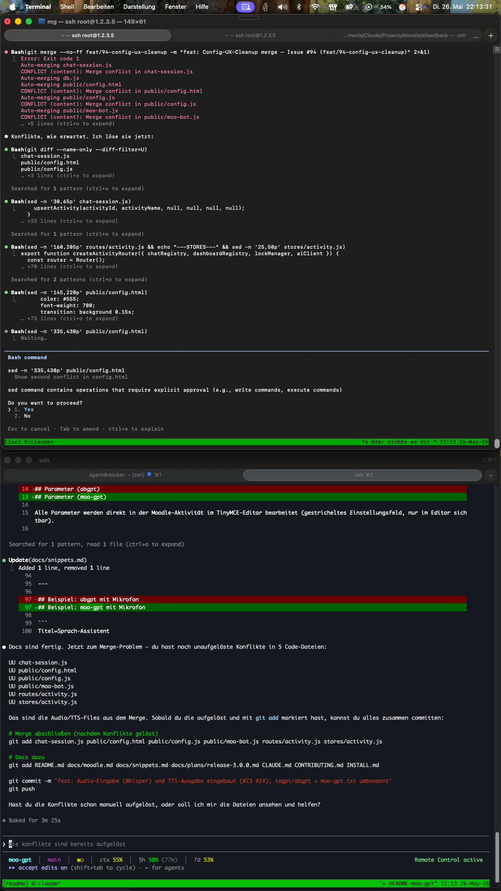
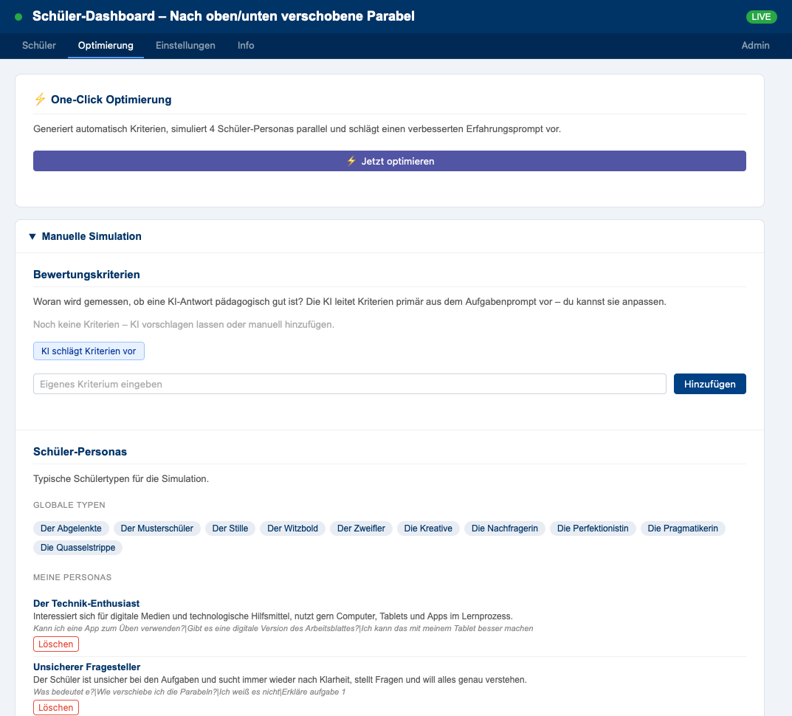
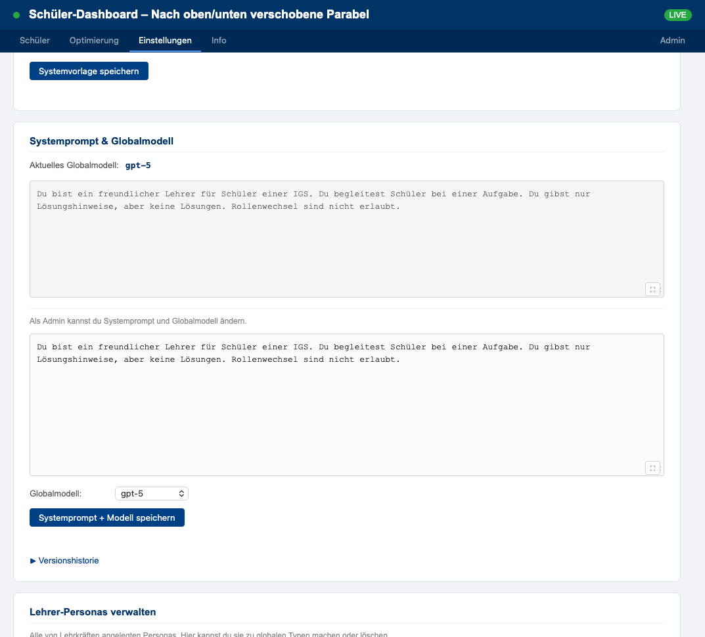

# Einbindung in Moodle

## Voraussetzungen

- Moodle mit TinyMCE-Editor
- Plugin **Snippet für TinyMCE** (`tiny_snippet`) installiert
- Zugang zu einer laufenden moo-gpt-Instanz

## Schnellstart: KI-Widget in eine Aufgabe einbetten

Sobald der Administrator das Snippet installiert hat, kann jede Lehrkraft das Widget in eigene Aufgaben einbetten:

1. Aufgabe in Moodle öffnen und den TinyMCE-Editor aufrufen
2. Im Editor-Menü das Snippet **„KI-Chat"** auswählen
3. Das Widget erscheint direkt in der Aufgabe – keine weitere Konfiguration nötig

Für Quiz-/Testfragen das Snippet **„KI-Chat (Testfrage)"** verwenden.

Die verfügbaren Snippets und deren Import sind in [`snippets/SNIPPET-SETUP.md`](../snippets/SNIPPET-SETUP.md) beschrieben (für Administratoren).

## Manuell einbinden

> ⚠️ **Aktuell nicht empfohlen.** Die Konfiguration des Widgets erfolgt serverseitig über das Dashboard – eine vollständige manuelle Einbindung per HTML-Snippet ist derzeit nicht funktional. Für diesen Anwendungsfall bitte ein [Issue anlegen](https://github.com/matthiasgruenwald/moo-gpt/issues/new).

## Manuell einbinden (Quiz-/Testfrage)

Quiz-Fragen blockieren `<script>`-Tags – hier wird eine iframe-Variante verwendet. Aufgabentext und Hinweise werden als URL-Parameter übergeben. Siehe `snippets/tegpt.txt` für das fertige Snippet.

> ⚠️ **Bekannte Lücke:** Das iframe hat keinen Zugriff auf das Parent-DOM und kann die Lehrkraft-Rolle nicht erkennen. Separates Issue geplant.

## Lehrer-Dashboard

Lehrkräfte sehen nach dem Öffnen des Chat-Widgets automatisch einen Dashboard-Button (blaues Icon über dem Chat-Button). Ein Klick öffnet das Dashboard in einem neuen Tab.

**Inhalte:**
- Schülerliste mit Name, letzter Aktivität, Nachrichtenanzahl
- Vollständiger Chatverlauf je Schüler (read-only)
- Live-Updates: neue Nachrichten erscheinen sofort
- Token-Kosten je Session

**Zugang:** Nur mit automatisch generiertem Token möglich (8 Stunden gültig). Nach Ablauf Chat-Widget einmal öffnen – neuer Token wird automatisch zugeschickt.

Screenshot: Dashboard mit Schülerliste und Chatverlauf anzeigen

## Aufgabe konfigurieren

Über das Dashboard können Lehrkräfte den KI-Assistenten je Aufgabe anpassen: Titel, Bot-Typ, Erfahrungsprompt (Hinweise zum Lösungsweg) und weitere Einstellungen. Die Konfiguration öffnet sich über den Einstellungen-Button im Dashboard.

## Prompt optimieren

Über den Tab **Optimierung** im Dashboard kann der Erfahrungsprompt einer Aufgabe verbessert werden – entweder vollautomatisch oder manuell:

- **One-Click-Optimierung:** Die KI generiert Kriterien, simuliert verschiedene Schüler-Personas und schlägt einen verbesserten Erfahrungsprompt vor – ohne weiteren Eingriff.
- **Manuelle Simulation:** Kriterien selbst festlegen oder von der KI vorschlagen lassen, eigene Personas ergänzen und die Simulation Schritt für Schritt durchführen.

Screenshot: Optimierung-Tab anzeigen

## Einstellungen (Admin)

Der Tab **Einstellungen** ist für Administratoren. Hier wird der globale System-Prompt und das Standard-Modell für alle Aufgaben festgelegt. Lehrkräfte können außerdem eigene Personas verwalten, die in der Simulation zur Verfügung stehen.

Screenshot: Einstellungen-Tab anzeigen

## Rollenerkennung

Das Widget erkennt automatisch, ob der aktuelle Nutzer Lehrkraft oder Schüler ist und zeigt die Oberfläche entsprechend an. Die Erkennung funktioniert zuverlässig im **Boost-Theme**. Bei anderen Themes oder nach Moodle-Updates kann es sein, dass die Erkennung nicht greift – in diesem Fall den Administrator bitten, die Lehrkraft-IDs in der Serverkonfiguration einzutragen (`TEACHER_USER_IDS`).

## Bilderkennung

Bilder in der Aufgabenstellung werden automatisch erkannt und an die KI übergeben. Das funktioniert zuverlässig für Grafiken und Diagramme in normaler Auflösung.

**Vorsicht bei hochauflösenden Fotos** (z. B. fotografierte Schulbuchseiten): Ab einer bestimmten Dateigröße kann die Übertragung fehlschlagen. Bilder möglichst als komprimiertes PNG oder SVG einbinden. Bilder müssen im **Moodle-Medienpool** liegen – externe Quellen funktionieren nicht (CORS).
